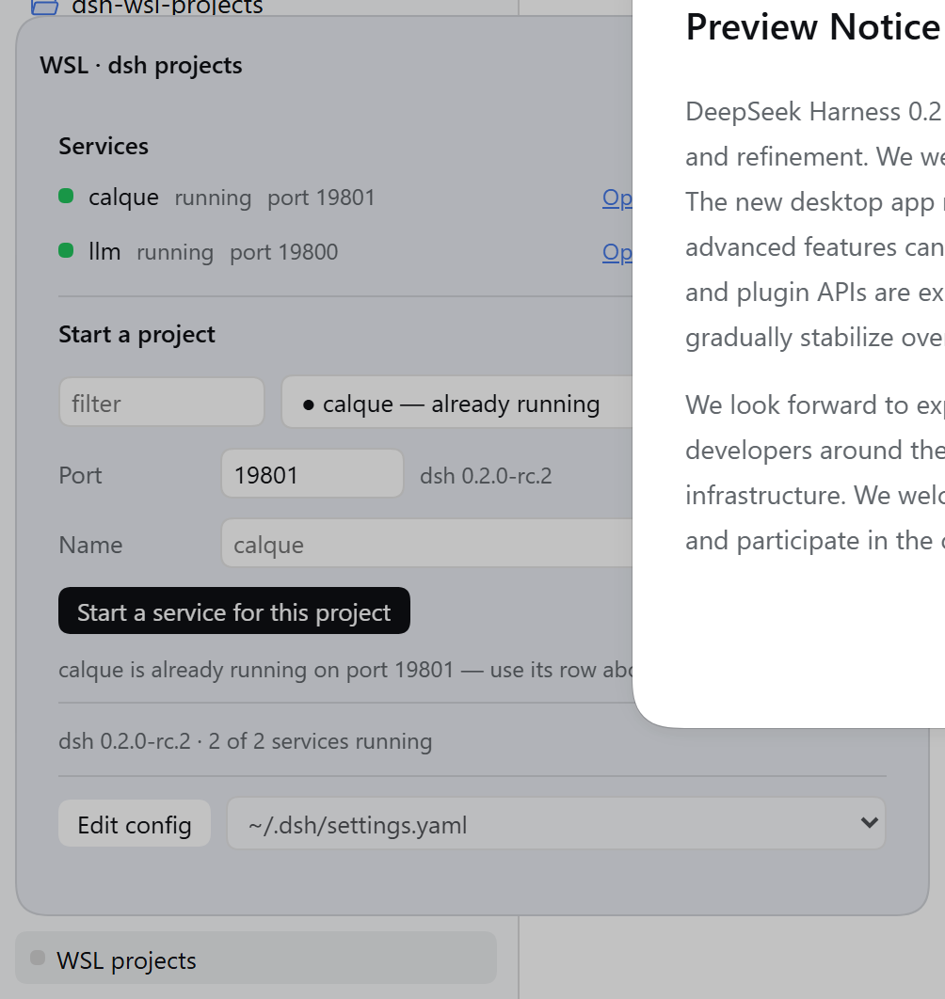
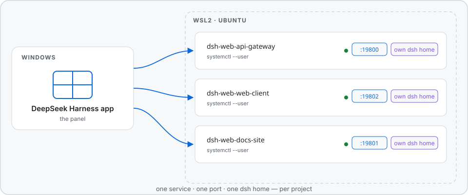

<p align="center">
  <picture>
    <source media="(max-width: 600px)" srcset="docs/banner-narrow.svg">
    <source media="(prefers-color-scheme: dark)" srcset="docs/banner-dark.svg">
    
  </picture>
</p>

**One DeepSeek Harness web server per project, inside WSL2 — started, stopped and opened from a panel in the Windows app.**

[](https://github.com/mvalentsev/dsh-wsl-projects/actions/workflows/checks.yml)
[](LICENSE)
[](#install)
[](package.json)
[](#requirements)

<p align="center">
  <picture>
    <source media="(max-width: 600px)" srcset="docs/panel-narrow.png">
    <source media="(prefers-color-scheme: dark)" srcset="docs/panel-dark.png">
    
  </picture>
</p>

## The problem

`dsh web` serves one workspace — the one its dsh home opened last. Point it at a
second project and the two fight over one home, one port and one token: links
open the wrong project, sessions mix, restarts kill your logins. Running several
projects at once means juggling terminals and ports by hand.

This plugin gives every project a place of its own — and one panel to drive them
all.

## What you get

- **One systemd user service per project.** Start and stop from the panel; a
  service survives a closed terminal.
- **One port per project.** A port is never handed to a second project, so a
  link always opens the project it belongs to.
- **One dsh home per project.** Conversations and sessions stay inside their
  project. The account is copied once, so nothing asks for a login again.
- **Links that answer.** The panel shows a link only after the server answers
  it — no dead tokens.
- **A panel in the app.** Every service with its state, its port and its
  controls: Open, Stop, Start, Restart, Remove. Start a project by picking it,
  naming it and choosing a port. The state refreshes every five seconds, so the
  panel shows what is true now.
- **Two surfaces for programs.** A REST API under `/wsl-projects/api/`, and the
  `wsl_dsh` agent tool that gives the model the same operations.

<p align="center">
  <picture>
    <source media="(max-width: 600px)" srcset="docs/architecture-narrow.svg">
    <source media="(prefers-color-scheme: dark)" srcset="docs/architecture-dark.svg">
    
  </picture>
</p>

## Requirements

- Windows with the DeepSeek Harness app.
- WSL2 with a Linux distribution. The plugin is tested on Ubuntu; other
  distributions are not tested.
- `dsh` in that distribution, reachable in `PATH`.
- systemd in the distribution — the plugin uses `systemctl --user`.
- `bash` in that distribution.
- A folder with your projects: `~/projects` by default, configurable.

## Install

1. Run this command in a terminal on Windows:

   ```powershell
   dsh plugin --profile desktop add <path-or-github-spec>
   ```

   Use `--profile web` for a plain `dsh web` profile. A path to a local clone
   works too.

2. Quit the DeepSeek Harness app and start it again.

   A page reload is not sufficient. The app loads the two halves of the plugin
   at different times: the panel arrives with the client half, and the host
   half is part of the start sequence.

## Use

1. Open the panel — it lives at the foot of the sidebar.
2. Select a project under **Start a project**.
3. Push **Start a service for this project**.
4. Push **Open** in the new row.

## Configuration

Add the settings to a profile patch:

```yaml
- id: wsl-projects
  name: dsh-wsl-projects
  config:
    distro: Ubuntu
    projectsRoot: ~/projects
    unit: dsh-web.service
    defaultPort: 19800
    configFiles:
      - ~/.dsh/settings.yaml
      - ~/.dsh/profiles/web/cordis.patch.yml
```

| Key | Meaning | Default |
| --- | --- | --- |
| `distro` | The distribution to use. | the WSL default |
| `projectsRoot` | The folder with your projects. | `~/projects` |
| `unit` | The systemd user unit that owns the WSL dsh. | `dsh-web.service` |
| `defaultPort` | The first port for a new service. | `19800` |
| `configFiles` | The files the panel can edit. | the standard dsh files |

## Where the panel lives

The panel sits in the sidebar foot by default. Two other positions are
available — set a global before the bundle starts:

```js
window.__DSH_WSL_PROJECTS_SURFACE__ = 'settings'  // a page in Settings
window.__DSH_WSL_PROJECTS_SURFACE__ = 'floating'  // a movable panel
```

## How it works

A project is the unit of control. Each project gets its own dsh home at
`~/.dsh/dsh-wsl-projects/homes/<folder>-<tag>/`. The tag comes from the path, so
two projects with the same folder name get separate homes. At the first start,
the launcher makes the home, copies the account from `~/.dsh` one time, and
writes the project into that home's workspace storage.

The isolation is the point, and three rules follow from how `dsh` behaves:

- `dsh` opens the workspace that `$DSH_HOME/storages/workspace.json` names — it
  does not compare it with the folder that started it. One home per project is
  what keeps every service on its own project.
- `dsh` identifies a browser session by host and port. One port per project is
  what keeps sessions from bleeding across projects.
- A token belongs to one process, so a token from an earlier start is dead. A
  link is offered only after the running server answers it.

## Automation

The REST surface is at `/wsl-projects/api/` — `state`, `units`, `projects`,
`distros`, `start`, `stop`, `restart`, `stop-unit`, `restart-unit`,
`remove-unit`, `config`, `alias`. The agent tool `wsl_dsh` offers the same
operations to the model.

## Troubleshooting

<details>
<summary><b>The panel does nothing, and it says the host half is older.</b></summary>

The app runs the host half from the moment it starts. Quit the app and start it
again. A page reload is not sufficient.
</details>

<details>
<summary><b>Open shows the wrong project.</b></summary>

Look at the address. One port serves one project, and each project has its own
home. Start the project again, then push Open in its own row.
</details>

<details>
<summary><b>Open shows an error about authentication.</b></summary>

The link is old. Push Stop, then Start. The panel checks a link before it shows
it.
</details>

<details>
<summary><b>A project asks for a login again.</b></summary>

The home of that project holds a copy of the account, and the copy does not
follow a later change in `~/.dsh`. Remove the copy, then start the project:

```sh
rm ~/.dsh/dsh-wsl-projects/homes/<folder>-<tag>/.credentials.yaml
```
</details>

<details>
<summary><b>A service does not start.</b></summary>

Look at its log:

```sh
journalctl --user -u dsh-web-<folder>-<tag>.service -n 40
```
</details>

## Development

```sh
npm run check            # every check, in one sequence
npm run check:offline    # only the checks that need no distribution
```

The panel images above are screenshots of the real panel:
`node scripts/capture-panel.mjs <url>` takes them again from a running app.
The banner and the architecture diagram are drawings, each in a light, a dark
and a narrow variant, in `docs/`.

CI runs the offline checks on Node 20, 22 and 24. What each check covers, and
how to run the ones that need a real distribution or a browser, is in
[CONTRIBUTING.md](CONTRIBUTING.md).

## Security

- The plugin runs with your rights: it uses `systemctl --user`, and it reads and
  writes files in the distribution.
- The host accepts requests from the panel's own origin only; a request with a
  different origin gets an error.
- The origin check is not authentication: a local process with the same user
  rights can still reach the loopback port.

## License

MIT — see [LICENSE](LICENSE).
